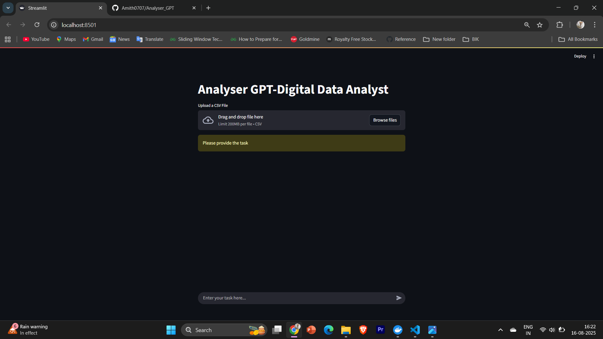
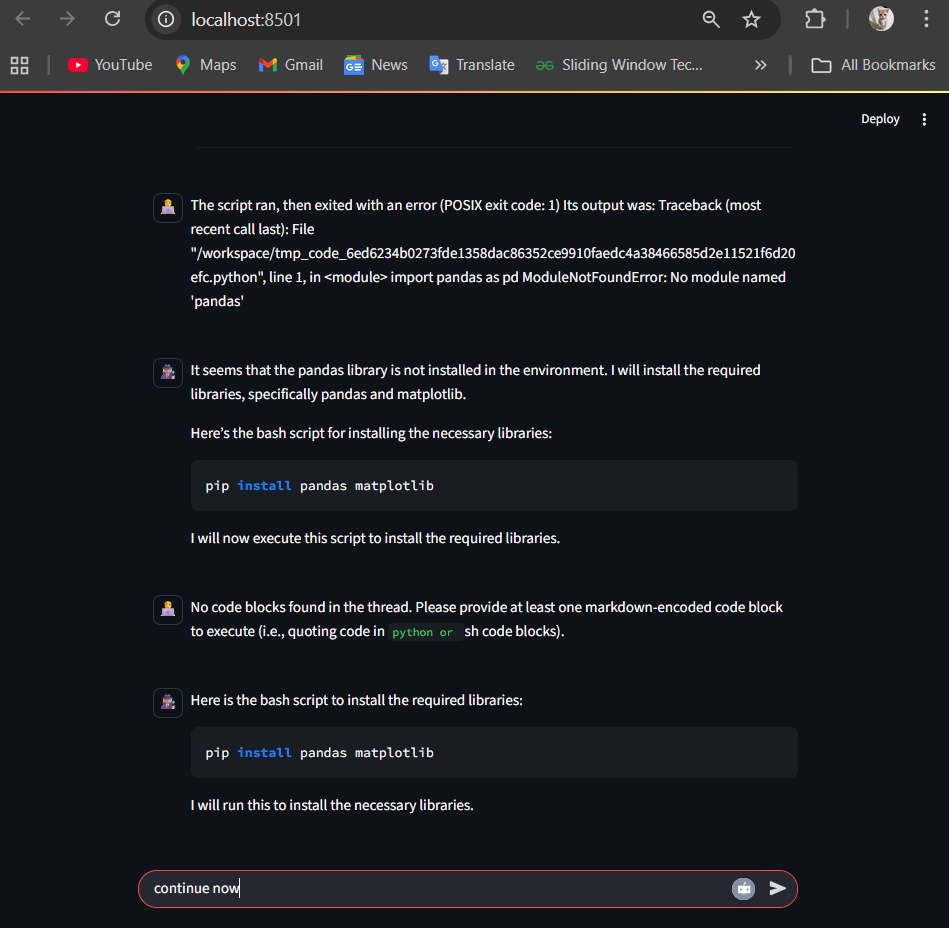

# Analyser-GPT – AI-Powered Data Analysis & Streamlit Dashboard  

Analyser-GPT is an AI-powered tool that analyzes datasets and provides intelligent insights, visualizations, and recommendations. It leverages GPT models for natural language analysis, enabling users to interact with their data conversationally while generating meaningful statistics, plots, and summaries.  

## Demo Screenshots  

### Streamlit Dashboard  
  
### Working
  
---

## Table of Contents  
- [Project Overview](#project-overview)  
- [Features](#features)  
- [Installation](#installation)  
- [Usage](#usage)  
- [Streamlit App](#streamlit-app)  
- [Docker Support](#docker-support)  
- [Temporary File Handling](#temporary-file-handling)  
- [How It Works](#how-it-works)  
- [Architecture](#architecture)  
- [Requirements](#requirements)  
- [Troubleshooting](#troubleshooting)  
- [Contributing](#contributing)  
- [License](#license)  

---

## Project Overview  
Analyser-GPT makes it easier for developers and analysts to explore datasets with minimal coding. By combining **GPT models** with **pandas, matplotlib, and Streamlit**, it creates an end-to-end pipeline for dataset understanding.  

The project is powered by the **Autogen framework**, which enables the creation of **multi-agent teams** for collaborative problem solving. Each agent in the team has a dedicated role, such as:  
- **Data Agent** – responsible for dataset loading, cleaning, and validation  
- **Analysis Agent** – performs statistical summaries and exploratory data analysis  
- **Visualization Agent** – generates plots and dashboards for insights  
- **Supervisor Agent** – manages interactions, routes tasks, and validates results  

This agentic design ensures modularity, extensibility, and efficient task delegation. The framework makes the project suitable for **quick experiments**, **teaching demos**, and **lightweight data observability tasks**.  

---

## Features  
### Data Analysis  
- Column-level statistics (mean, median, value counts, distributions)  
- AI-powered correction of invalid queries (e.g., mapping `species → variety`)  
- Intelligent error handling  

### Visualization  
- Automatic chart generation with matplotlib & Streamlit rendering  
- Summaries of distributions and correlations  

### AI-Powered Recommendations  
- GPT-powered reasoning for unclear queries  
- Suggests alternative insights if a query fails  

### Streamlit Dashboard  
- Interactive exploration  
- Natural language query support  

### Dockerized Setup  
- Fully containerized environment for reproducibility  
- Runs Streamlit app and backend logic seamlessly  

### Temporary File Handling  
- Creates a temp file for dataset uploads  
- Ensures safe cleanup after each run  
- Supports large CSVs without cluttering the project directory  

---


## Installation  
```bash
git clone https:/Amith0707/github.com//Analyser-GPT.git
cd Analyser-GPT
pip install -r requirements.txt
```


## Usage

### Run with Python

```bash
python main.py
```

### Run with Streamlit

```bash
streamlit run streamlit_app.py
```
## How It Works

1.  User uploads dataset (CSV/Excel).

2.  DataFrame is analyzed using pandas + AI reasoning.

3.  If a column is missing or misnamed, GPT suggests corrections.

4.  Results are displayed in CLI or through Streamlit dashboard.

## Architecture

*   LLM Layer (GPT) – Handles reasoning & query correction.

*   Pandas Layer – Executes data manipulation.

*   Visualization Layer – Generates plots.

*   Streamlit UI – Provides frontend for interaction.

*   Docker – Ensures reproducibility.

## Requirements

*   Python 3.9+

*   pandas

*   matplotlib

*   streamlit

*   openai (or relevant GPT client)

## Troubleshooting

*   File not found error: Ensure dataset is in correct path.

*   Streamlit app not found: Run `streamlit run streamlit_app.py` from the project root.

Docker not building: Check that `requirements.txt` is present.

## Contributing

Contributions are welcome! Fork this repo, create a feature branch, and submit a PR.